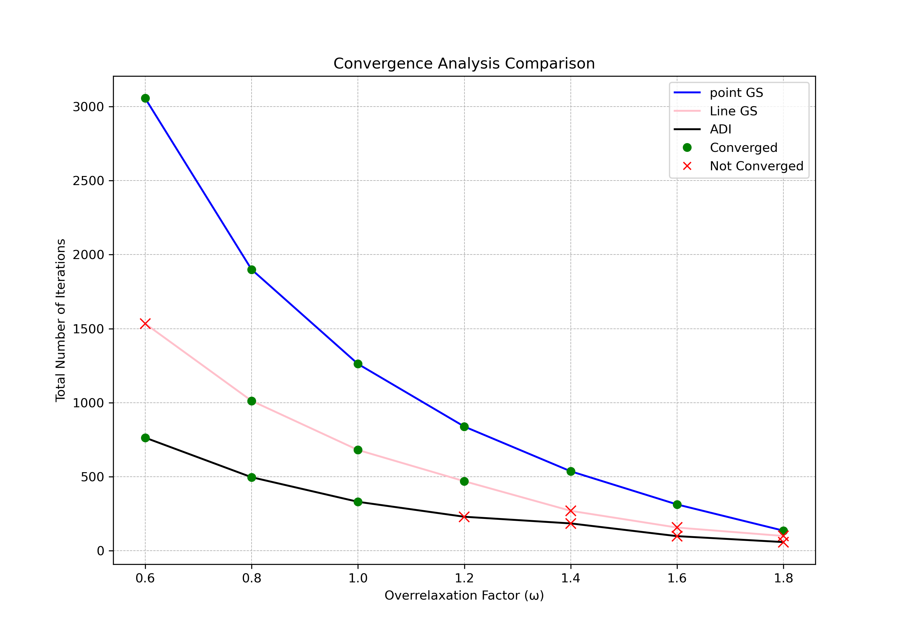
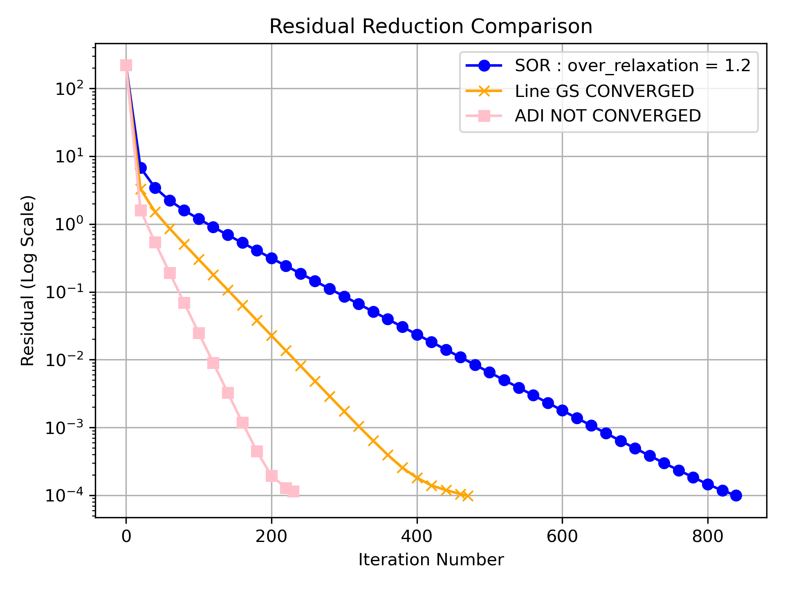
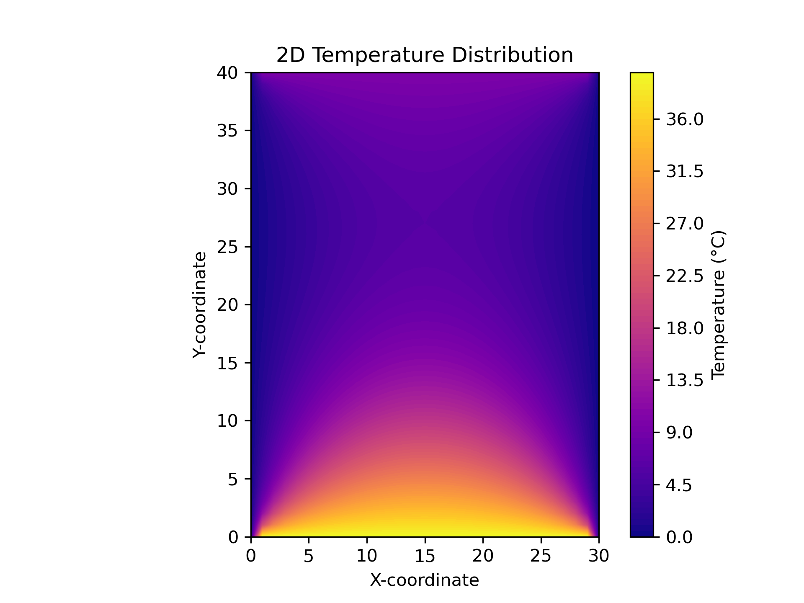

# 2D Heat Conduction Solver 🌡️

This project provides a numerical solution for the steady-state temperature distribution in a two-dimensional rectangular plate. The core solver is written in C++, and a Python script automates the entire process of compiling, running, and visualizing the results.

***

## Problem Statement

The goal is to find the steady-state temperature field $T(x,y)$ on a rectangular plate with the following specifications:
* **Dimensions**: Length $L = 0.3$ m and Height $H = 0.4$ m.
* **Material Properties**: Thermal conductivity of 380 W/m-K and thermal diffusivity of 11.234×10⁻⁵ m²/s.
* **Boundary Conditions**: The plate edges are held at constant temperatures of $T(x, 0) = 40$ °C, $T(x, H) = 10$ °C, $T(0, y) = 0$ °C, and $T(L, y) = 0$ °C.

***

## Numerical Methods Implemented

The C++ solver was built from scratch to implement and compare three different iterative methods for solving the system of linear equations derived from the finite difference discretization:
1.  **Point Gauss-Seidel with Successive Over-Relaxation (SOR)**
2.  **Line Gauss-Seidel with SOR** (using the Thomas Algorithm)
3.  **Alternating Direction Implicit (ADI) Method**

***

## How to Run 🚀

The project is designed for simple execution. The Python script handles everything.

1.  **Configure the Simulation**: Open the **`input.dat`** file to adjust parameters like the grid spacing (`delta_x`, `delta_y`), max iterations (`max_iter`), or the desired over-relaxation factor for analysis (`wanted_over_relaxation`).

2.  **Execute the Script**: Run the following command in your terminal. The script will automatically compile the C++ code, execute the solver, and generate the result plots in the project directory.
    ```sh
    python3 results.py
    ```

***

## Results & Analysis

### Convergence Performance

The analysis shows the number of iterations required for each method to converge across a range of over-relaxation factors (ω). The **ADI method is consistently the most efficient**, requiring the fewest iterations to reach a solution.



### Residual Reduction

By plotting the residual error on a log scale, we can see the rate of convergence per iteration. The ADI method shows a much steeper decline, confirming its superior convergence speed compared to the other methods for this problem.



### Final Temperature Distribution

The final solution shows the steady-state temperature field across the plate. The contour plot confirms that the temperature is highest at the bottom boundary ($40$ °C) and decreases towards the colder boundaries, as expected physically.


